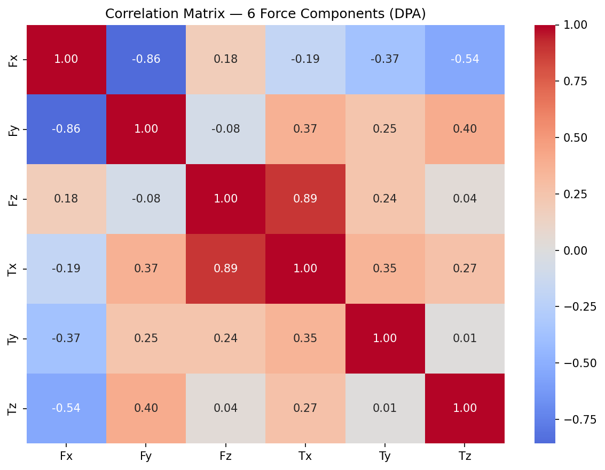
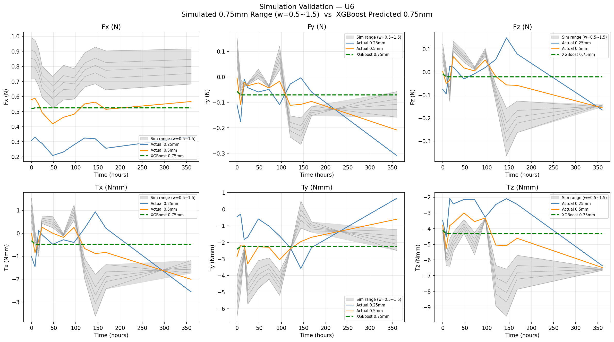
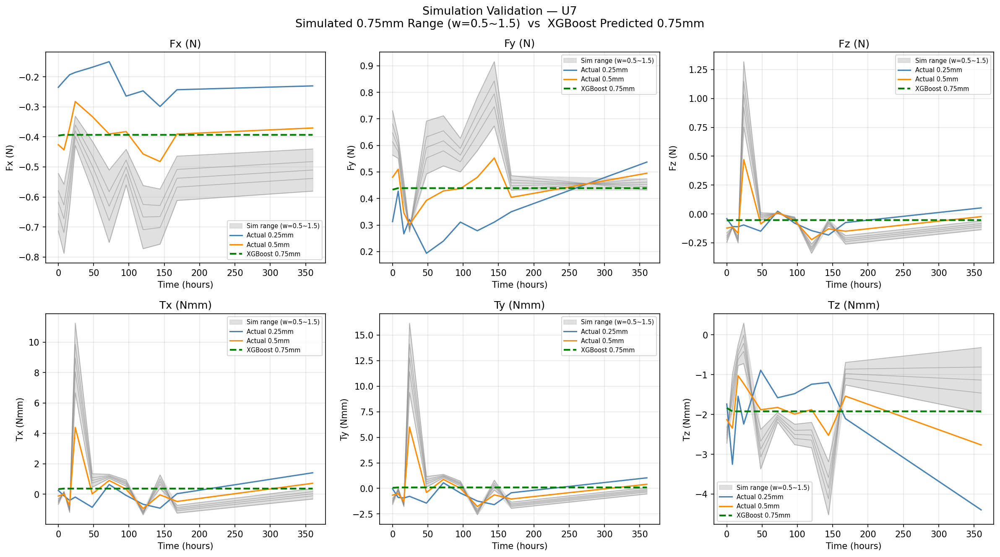
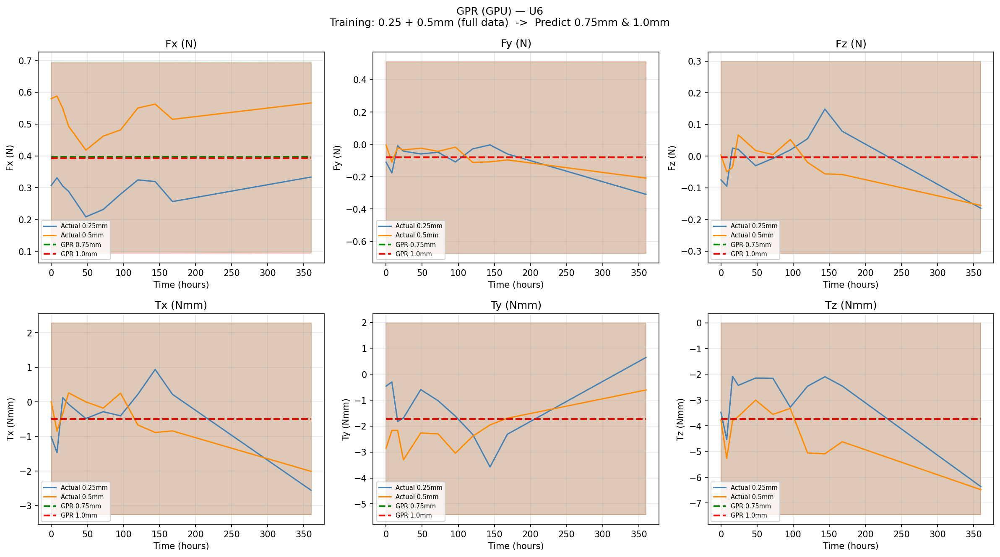
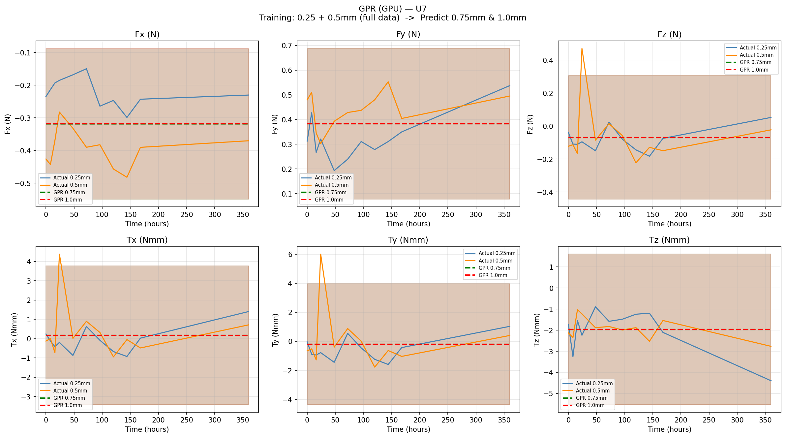
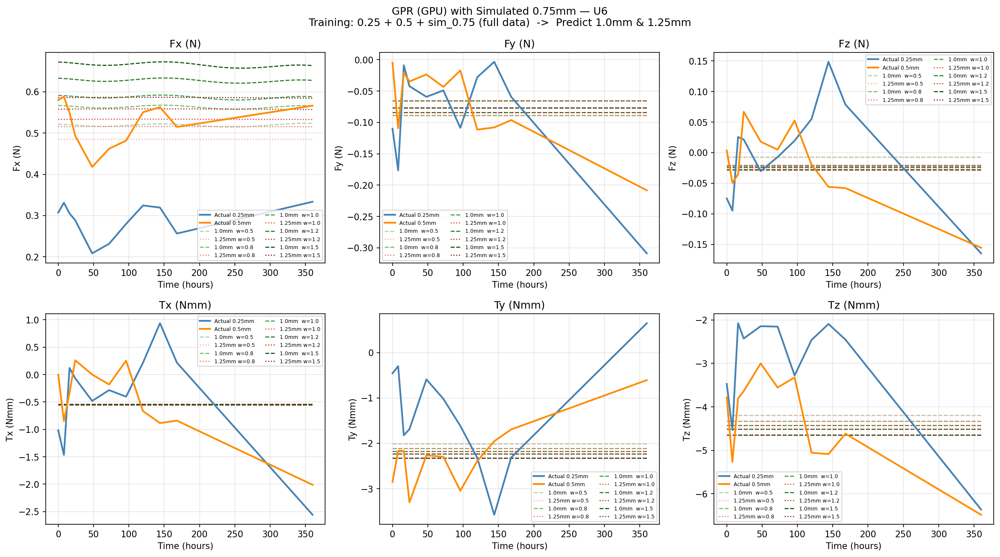
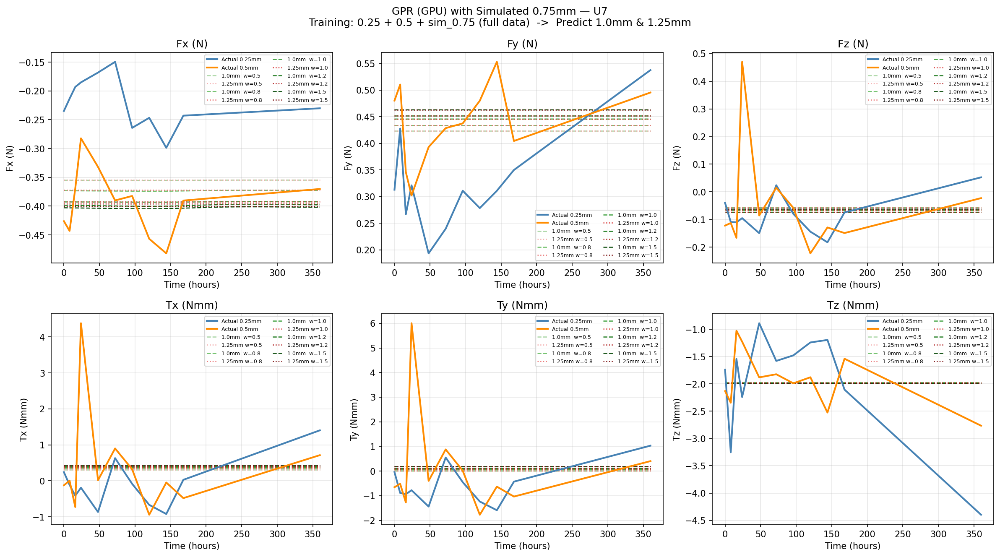

# Dental ML Force Prediction

Machine learning models for predicting orthodontic aligner forces across different aligner thicknesses (0.25mm, 0.5mm, 0.75mm, 1.0mm, 1.25mm).

## Background

Orthodontic aligners apply forces and moments to teeth during treatment. This project uses ML to predict those forces at thicknesses where no real experimental data exists, using data from 0.25mm and 0.5mm aligners.

**Teeth analyzed:** U6, U7
**Forces & Moments:** Fx, Fy, Fz (N), Tx, Ty, Tz (Nmm)

---

## Project Structure

```
dental-ml-force-prediction/
├── correlation/        # Force correlation analysis
├── xgboost/           # XGBoost-based prediction
└── gpr/               # Gaussian Process Regression prediction
```

---

## 1. Correlation Analysis

Pairwise correlations between all 6 force/moment components.



→ See [`correlation/README.md`](correlation/README.md)

---

## 2. XGBoost

Trains XGBoost on 0.25mm + 0.5mm data and compares against simulated 0.75mm range.

**Key finding:** XGBoost cannot extrapolate — predictions at 0.75mm and 1.0mm are identical flat lines.




→ See [`xgboost/README.md`](xgboost/README.md)

---

## 3. GPR — Gaussian Process Regression

GPR with Matern kernel (ν=1.5) trained on real + simulated data to predict 1.0mm & 1.25mm forces.

### Step 1: Real data only → predicts 0.75mm & 1.0mm
*(Shaded band = model uncertainty, μ ± 2σ)*




### Step 2: With simulated 0.75mm → predicts 1.0mm & 1.25mm
*(Multiple lines = data uncertainty from simulation weights w = 0.5~1.5)*




| | Step 1 | Step 2 |
|---|--------|--------|
| 1.0mm vs 1.25mm distinction | ❌ Nearly identical | ✅ Different values |
| Uncertainty representation | Confidence band (μ ± 2σ) | Multiple prediction lines |
| Time trend | ❌ Flat | ❌ Still flat |

→ See [`gpr/README.md`](gpr/README.md)

---

## Environment
- Python 3.9
- PyTorch + GPyTorch (GPU)
- XGBoost, scikit-learn, pandas, matplotlib
- GPU: NVIDIA L40S (Libra HPC) for GPR training
