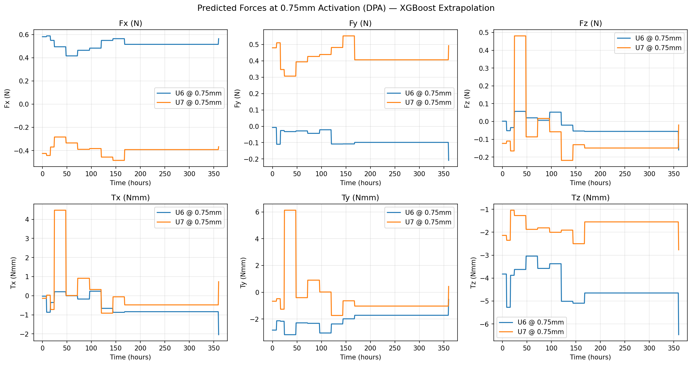
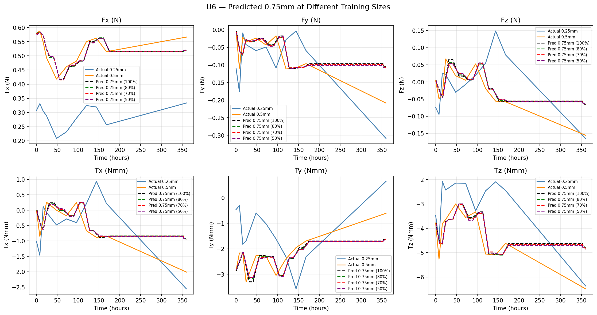
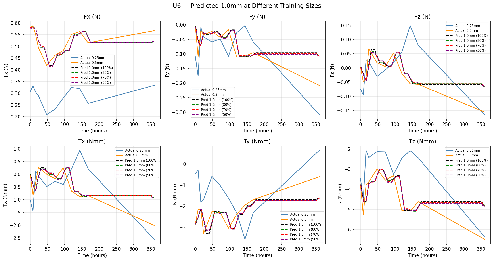
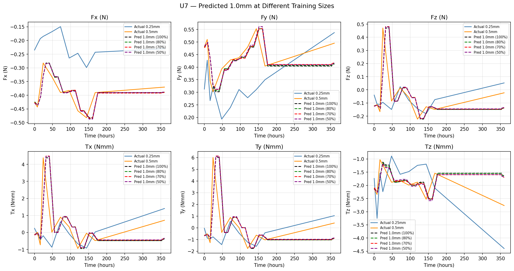

# XGBoost — Force Prediction

Uses XGBoost to predict orthodontic forces at 0.75mm and 1.0mm aligner thickness, trained on 0.25mm and 0.5mm data.

## Limitation

XGBoost is a tree-based model and **cannot extrapolate** beyond the training data range. Predictions at 0.75mm and 1.0mm produce identical flat lines — the model simply repeats the boundary value for any input outside the training range. This limitation motivated the switch to GPR (see [`../gpr/`](../gpr/)).

## Inputs

- `smith_dataset.csv` — original dataset (filtered by `extract_dpa.py`). **Not included** in this repo.

## Scripts

| File | Description |
|---|---|
| `extract_dpa.py` | Filters `smith_dataset.csv` to DPA rows and splits by thickness → `dpa_025.csv`, `dpa_05.csv`. **Run this first.** |
| `xgboost_force_prediction.py` | One XGBoost regressor per force component. Trains on 0.25 + 0.5mm, predicts 0.75mm & 1.0mm, plots all 6 components. |
| `generate_sim_075.py` | Generates simulated 0.75mm data using a weighted delta method (5 weights w = 0.5, 0.8, 1.0, 1.2, 1.5). |
| `simulation_075.py` | Compares XGBoost predictions against the simulated 0.75mm range. |
| `linear_extrapolation.py` | Linear extrapolation baseline `f(0.75) = 2·f(0.5) − f(0.25)`. |
| `plot_comparison.py` | Plots actual-vs-predicted force comparisons. |
| `xgboost_split_comparison.py` | Compares XGBoost behaviour across different train/test splits. |

> Note: `generate_sim_075.py` is identical to the file of the same name in `../gpr/`. The duplicate may be removed in a future cleanup.

## How to run

```bash
cd xgboost
python extract_dpa.py
python xgboost_force_prediction.py
python linear_extrapolation.py
python xgboost_split_comparison.py
python generate_sim_075.py
python simulation_075.py
python plot_comparison.py
```

## Simulation Method

Simulated 0.75mm data is generated as:

$$f_{\text{sim}}(0.75\text{mm}, t) = f_{\text{individual}}(0.5\text{mm}, t) + w \cdot \delta(t)$$

Where:

- $\delta(t) = \overline{f}(0.5\text{mm}, t) - \overline{f}(0.25\text{mm}, t)$ — per-time-point mean difference
- $w \in \{0.5, 0.8, 1.0, 1.2, 1.5\}$ — five weights covering a plausible simulation range

## Results

### XGBoost prediction at 0.75mm (both teeth)



### XGBoost vs Simulation Range

| Tooth U6 | Tooth U7 |
|---|---|
|  |  |

### Force Comparison (actual 0.25/0.5mm vs predicted 0.75mm)

| Tooth U6 | Tooth U7 |
|---|---|
|  |  |

### Linear Extrapolation Baseline

| Tooth U6 | Tooth U7 |
|---|---|
|  |  |

### Train/Test Split Comparison

| 0.75mm split | 1.0mm split |
|---|---|
|  |  |
|  |  |
