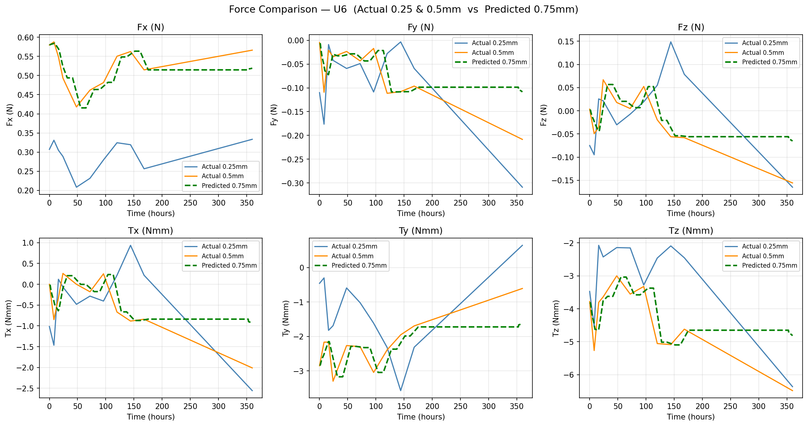
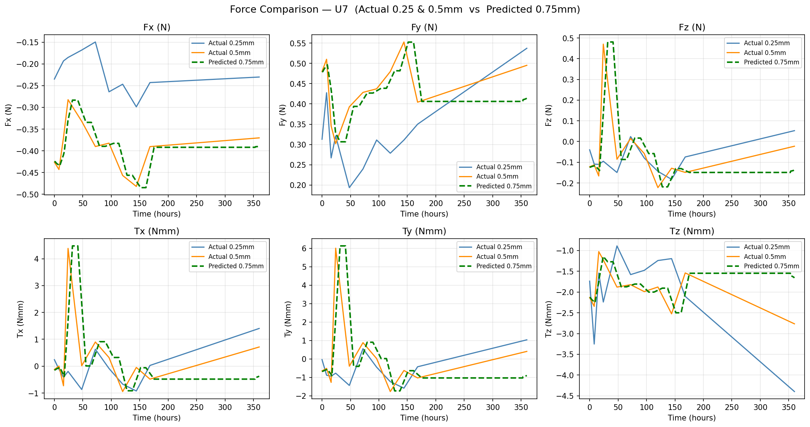
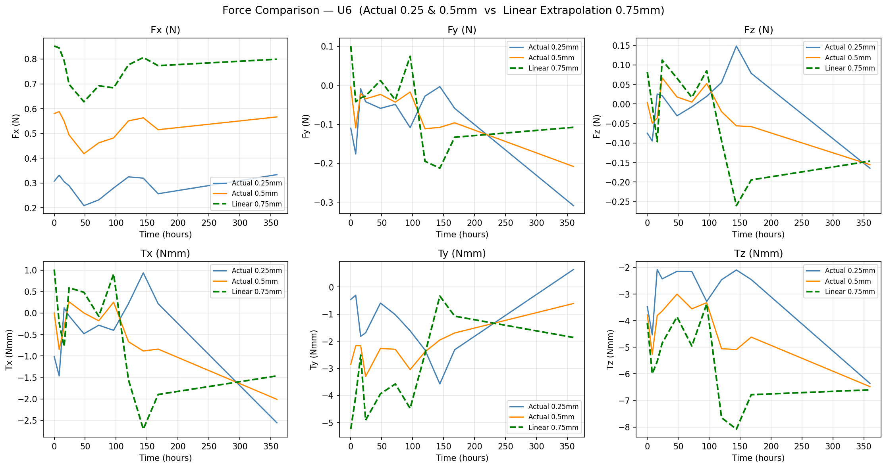
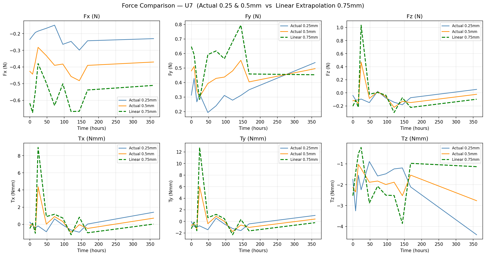

# XGBoost — Force Prediction

Uses XGBoost to predict orthodontic forces at 0.75mm aligner thickness, trained on 0.25mm and 0.5mm data.

## Limitation
XGBoost is a tree-based model and **cannot extrapolate** beyond the training data range.
Predictions at 0.75mm and 1.0mm produce identical flat lines — the model simply repeats the boundary value for any input outside the training range.
This limitation motivated the switch to GPR (see `../gpr/`).

## Scripts
| File | Description |
|------|-------------|
| `extract_dpa.py` | Extracts and preprocesses DPA data from Smith dataset |
| `xgboost_force_prediction.py` | Trains XGBoost on 0.25 + 0.5mm, predicts 0.75mm & 1.0mm |
| `generate_sim_075.py` | Generates simulated 0.75mm data using weighted delta method |
| `simulation_075.py` | Compares XGBoost predictions vs simulated 0.75mm range |
| `linear_extrapolation.py` | Linear extrapolation baseline for comparison |
| `plot_comparison.py` | Plots actual vs predicted force comparisons |
| `xgboost_split_comparison.py` | Compares XGBoost across different data splits |

## Simulation Method
Simulated 0.75mm data is generated as:

$$f_{sim}(0.75mm) = f_{individual}(0.5mm) + w \times \delta(t)$$

Where:
- δ(t) = mean(0.5mm, t) − mean(0.25mm, t) per time point
- w = [0.5, 0.8, 1.0, 1.2, 1.5] — 5 weights to express simulation range

## Results

### XGBoost vs Simulation Range — Tooth U6

### XGBoost vs Simulation Range — Tooth U7

### Force Comparison — Tooth U6

### Force Comparison — Tooth U7

### Linear Extrapolation — Tooth U6

### Linear Extrapolation — Tooth U7

